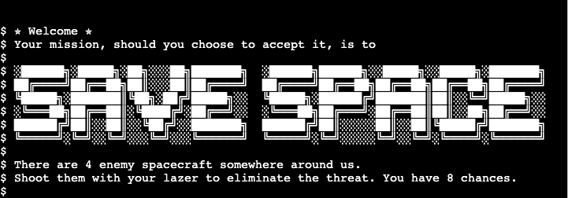
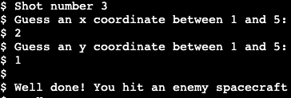
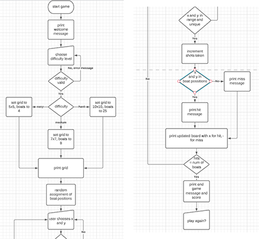
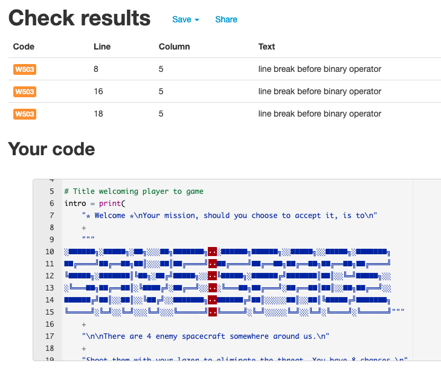

<h1 align="center">Save Space</h1>

[View the live project here.](https://save-space.herokuapp.com/)

An interactive command line game in the style of Battleships, in which players guess coordinates in order to shoot enemy spacecraft.

<h2 align="center"></h2>

Each target occupies one spot on the grid. A successful guess results in a hit and an unsuccessful guess results in a miss. The game ends when the player has either hit all targets or used all their guesses, and they are told how many targets they hit. At the end of the game the player is given the choice to play again.

## Features

-   ### Existing

    -   target coordinates are randomly generated and cannot be duplicates

    -   user input is accepted, stored, and compared to target data

    -   the user is given feedback after each input

    <h2 align="center"></h2>

    -   validity of input is checked - the same guess cannot be made twice and the guess must be within the range of the board size

    -   game board is updated after each guess to display either a hit or miss at the guessed coordinate

    -   the number of hits is stored and displayed to the user at the end of the game

-   ### Future 
    -   user could choose difficulty level at the start of the game, as per the initial flow diagram
        -   the size of the board, number of targets, and number of guesses are stored as variables - this gives them the possibility of being set via user input

    -   add functionality for a range of target sizes
    

## Logic flow diagram

<h2 align="center"></h2>

## Technologies Used

### Language

-   [Python](https://en.wikipedia.org/wiki/Python_(programming_language))

### Other

- [Git](https://git-scm.com/)
    - Git was used for version control by utilizing the Gitpod terminal to commit to Git and Push to GitHub.
- [GitHub](https://github.com/)
    - GitHub is used to store the project code after being pushed from Git.
- [Gitpod](https://www.gitpod.io/)
    - Gitpod used as the coding workspace.
- [Heroku](https://www.heroku.com/)
    - Heroku was used for the deployment of the project.
- [Lucidchart](https://www.lucidchart.com/)
    - Lucidchart was used to create flow diagrams to illustrate the logic of the program.

## Testing

PEP8 code validation
- 3 errors for 'line break before binary operator' all within the ASCII title so left unresolved

<h2 align="center"></h2>

### Further Testing

-   Manual testing of the program both within the Gitpod terminal and the deployed version on Heroku
-   Invalid inputs given and tested to check that all error print messages display correctly and for the relevant user error
-   Deployed program tested by friends and family and no reported issues
-   Code validity tested throughout the process and PEP8 validated

Bugs

-   Random function to create target coordinates was creating duplicates and meant that the total number of targets was reduced
    - Fixed with a conditional statement to only add them if they are not already in the target list
-   When looping through gameplay it was allowing one more guess than the maximum number
    - Fixed by changing the comparison operator in the loop
-   Check for duplicate guesses was functioning unexpectedly and showed user errors when the condition was not true, then allowing that same guess to be accepted straight after
    - Fixed by placing the duplicate check in an if/elif/else statement with other conditions
-   When printing the initial gameboard it also prints 'None'
    - Unfixed as a fix that doesn't effect the running of the rest of the game not yet found

## Deployment

### GitHub Pages

The project was deployed using Code Institue's mock terminal for Heroku

1. Fork or clone the repository
2. Create a new Heroku app
3. Set the buildbacks to Python and NodeJS in that order
4. Link the Heroku app to the repository
5. Click button to Deploy

## Credits

### Code

-   All code written by the developer

### Acknowledgements

-   Code Institute Python workspace template and mock terminal Heroku template

-   Many thanks to both mentor and tutor support for their help during the project